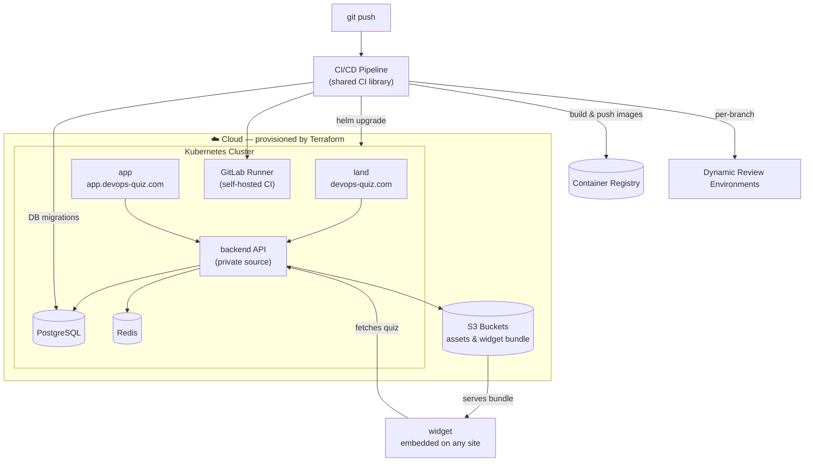

# DevOps Quiz

**Cloud-native quiz platform** — a production-grade system of ~20 microservices
deployed to Kubernetes via Helm, with the entire infrastructure — from cloud
network to the cluster itself — provisioned from code with Terraform.

🌐 Live: [devops-quiz.com](https://devops-quiz.com) · [app.devops-quiz.com](https://app.devops-quiz.com)

---

## What is this?

DevOps Quiz lets users **create quizzes**, **embed them on any website** via a
lightweight widget, and **manage everything** through an admin application.

This hub repository is the entry point to the whole platform: architecture
overview, links to all components, and a one-command local setup.

## Architecture



## Repositories

| Repository | Purpose | Access |
|---|---|---|
| **[DevOps-Quiz-Terraform](https://github.com/Slavk11/DevOps-Quiz-Terraform)** | IaC core: cloud network, Kubernetes cluster, S3 buckets | public |
| **[DevOps-Quiz-Infra](https://github.com/Slavk11/DevOps-Quiz-Infra)** | Platform infrastructure & environment configuration | public |
| **[DevOps-Quiz-Charts](https://github.com/Slavk11/DevOps-Quiz-Charts)** | Helm charts: umbrella chart + per-service subcharts, ingress & domain routing | public |
| **[DevOps-Quiz-CI-Lib](https://github.com/Slavk11/DevOps-Quiz-CI-Lib)** | Reusable CI/CD pipeline library: build → test → migrate → deploy | public |
| **[DevOps-Quiz-Gitlab-Runner](https://github.com/Slavk11/DevOps-Quiz-Gitlab-Runner)** | Self-hosted CI runners deployed in the cluster | public |
| **[DevOps-Quiz-Frontend](https://github.com/Slavk11/DevOps-Quiz-Frontend)** | Three apps: `land` (promo site), `app` (quiz builder & admin), `widget` (embeddable quiz renderer) | public |
| **DevOps-Quiz-Backend** | Core API: quiz engine, auth, data layer | 🔒 private (source closed) |

> Backend source is private, but its **Docker image is public** — the whole
> platform is fully runnable without access to the source code.

## Quick start (local)

```bash
git clone https://github.com/Slavk11/DevOps-Quiz.git
cd DevOps-Quiz
docker compose up -d
```

Starts the backend (public image), frontend apps, PostgreSQL and Redis.

## Full deploy (cloud)

From an empty cloud account to a running platform:

```bash
# 1. Provision infrastructure: network, cluster, S3, runners
git clone https://github.com/Slavk11/DevOps-Quiz-Terraform.git
cd DevOps-Quiz-Terraform && terraform init && terraform apply

# 2. Deploy the platform
git clone https://github.com/Slavk11/DevOps-Quiz-Charts.git
cd DevOps-Quiz-Charts && helm install devops-quiz ./umbrella
```

## CI/CD

Every push runs the full delivery cycle through the shared
[CI library](https://github.com/Slavk11/DevOps-Quiz-CI-Lib):

```
build images → tests → DB migrations → helm upgrade → deploy
```

- **Dynamic review environments** — every branch gets an isolated environment
  in the cluster with its own URL, torn down on merge
- **Zero-touch releases** — migrations and rollout fully automated, no manual
  steps between commit and production
- **Self-hosted runners** — CI runners live in the cluster
  ([DevOps-Quiz-Gitlab-Runner](https://github.com/Slavk11/DevOps-Quiz-Gitlab-Runner)),
  provisioned from code
- **Reusable pipeline library** — all ~20 services share one versioned set of
  CI templates instead of copy-pasted configs

## Tech stack

| Layer | Tools |
|---|---|
| Infrastructure | Terraform, Kubernetes, S3 |
| Delivery | Helm (umbrella chart), GitLab CI, self-hosted runners, dynamic review envs |
| Backend | REST API, PostgreSQL, Redis *(source private)* |
| Frontend | `land` + `app` + `widget`, widget shipped as a static bundle from S3/CDN |

## Highlights

- ⚡ **Infrastructure from zero** — the cluster isn't a given, it's created by code
- 📦 **~20 microservices, one command** — umbrella Helm chart deploys everything
- 🌿 **Review environment per branch** — isolated, disposable, automatic
- 🔁 **DRY pipelines** — one CI library serving every service in the platform
- 🔓 **Reproducible delivery** — closed source, open pipeline: anyone can run the platform

---

*Questions or feedback — open an issue or reach me on [GitHub](https://github.com/Slavk11).*
