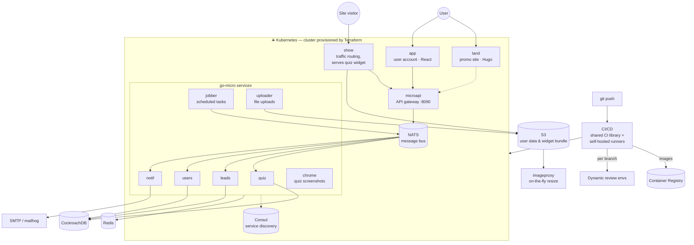

# DevOps Quiz

**Cloud-native quiz platform** — a microservice system (9 backend services,
3 frontend apps and a full set of stateful dependencies) deployed to
Kubernetes via Helm, with the entire infrastructure — from cloud network to
the cluster itself — provisioned from code with Terraform.

🌐 Live: [devops-quiz.com](https://devops-quiz.com) · [app.devops-quiz.com](https://app.devops-quiz.com)

---

## What is this?

DevOps Quiz lets users **create quizzes**, **embed them on any website** via a
lightweight widget, collect **leads** from quiz responses and manage everything
through a personal account.

This hub repository is the entry point to the whole platform: architecture,
links to all components, and deployment overview.

## Architecture



## Services

**Frontend** ([DevOps-Quiz-Frontend](https://github.com/Slavk11/DevOps-Quiz-Frontend)):

| App | Stack | Purpose |
|---|---|---|
| `app` | ReactJS | Quiz management & leads — user's personal account |
| `land` | Hugo (static) | Promo site |
| `widget` | JS bundle | Embeddable quiz renderer, served via `show` |

**Backend** (🔒 private source, public images) — Go microservices on **go-micro**:

| Service | Purpose |
|---|---|
| `microapi` | API gateway — single entry point for HTTP clients |
| `quiz` | Quiz domain logic |
| `leads` | Quiz responses / leads |
| `users` | User accounts |
| `notif` | Multi-channel notifications |
| `jobber` | Background & scheduled tasks |
| `chrome` | Quiz screenshots via headless Chrome |
| `show` | Traffic routing, serves the built widget |
| `uploader` | File uploads (from quizzes and the account) |

**Dependencies:** CockroachDB · Redis · NATS (message bus) · Consul (service
discovery) · imageproxy · S3-compatible storage · SMTP (mailhog for non-prod) ·
container registry · monitoring & logging · automated backups

## Platform repositories

| Repository | Purpose | Access |
|---|---|---|
| **[DevOps-Quiz-Terraform](https://github.com/Slavk11/DevOps-Quiz-Terraform)** | IaC core: cloud network, Kubernetes cluster, S3 buckets | public |
| **[DevOps-Quiz-Infra](https://github.com/Slavk11/DevOps-Quiz-Infra)** | In-cluster platform: ingress, TLS, stateful dependencies, review-env machinery | public |
| **[DevOps-Quiz-Charts](https://github.com/Slavk11/DevOps-Quiz-Charts)** | Helm charts: umbrella + per-service subcharts, domain routing | public |
| **[DevOps-Quiz-CI-Lib](https://github.com/Slavk11/DevOps-Quiz-CI-Lib)** | Reusable CI/CD pipeline library: build → test → migrate → deploy | public |
| **[DevOps-Quiz-Gitlab-Runner](https://github.com/Slavk11/DevOps-Quiz-Gitlab-Runner)** | Self-hosted CI runners in the cluster | public |
| **[DevOps-Quiz-Frontend](https://github.com/Slavk11/DevOps-Quiz-Frontend)** | `app` + `land` + `widget` | public |
| **DevOps-Quiz-Backend** | 9 Go microservices | 🔒 private (source closed) |

## Full deploy (cloud)

From an empty cloud account to a running platform:

```bash
# 1. Infrastructure: network, cluster, S3
git clone https://github.com/Slavk11/DevOps-Quiz-Terraform.git
cd DevOps-Quiz-Terraform && terraform init && terraform apply

# 2. In-cluster platform: ingress, TLS, databases, NATS, Consul
#    see DevOps-Quiz-Infra

# 3. Application services
git clone https://github.com/Slavk11/DevOps-Quiz-Charts.git
cd DevOps-Quiz-Charts && helm install devops-quiz ./umbrella
```

## CI/CD

Every push runs the full delivery cycle through the shared
[CI library](https://github.com/Slavk11/DevOps-Quiz-CI-Lib) on
[self-hosted runners](https://github.com/Slavk11/DevOps-Quiz-Gitlab-Runner):

```
build images → tests → DB migrations → helm upgrade → deploy
```

- **Dynamic review environments** — every branch gets an isolated environment
  with its own URL, torn down on merge
- **Zero-touch releases** — migrations and rollout fully automated
- **DRY pipelines** — all services share one versioned CI template library
  instead of copy-pasted configs

## Tech stack

| Layer | Tools |
|---|---|
| Infrastructure | Terraform, Kubernetes, S3 |
| Delivery | Helm (umbrella chart), GitLab CI, self-hosted runners, review envs |
| Backend | Go, go-micro, NATS, Consul, CockroachDB, Redis |
| Frontend | ReactJS (`app`), Hugo (`land`), static JS widget |
| Ops | Monitoring & logging, automated DB backups |

## Highlights

- ⚡ **Infrastructure from zero** — the cluster isn't a given, it's created by code
- 📦 **12 services, one command** — umbrella Helm chart deploys the whole platform
- 📨 **Event-driven core** — services talk through NATS with Consul discovery,
  not point-to-point HTTP spaghetti
- 🌿 **Review environment per branch** — isolated, disposable, automatic
- 🔁 **DRY pipelines** — one CI library serving every service
- 🔓 **Reproducible delivery** — closed source, open pipeline: anyone can run the platform

---

*Questions or feedback — open an issue or reach me on [GitHub](https://github.com/Slavk11).*
